Karłowacenie Śledzi
================
Adam Matuszak
02 luty, 2020

## Wyniki analizy

## Wykorzystane biblioteki

``` r
library(ggplot2)
```

## Powtarzalność danych

``` r
set.seed(1)
```

## Wczytanie danych

Wczytanie daych odbywa się poprzez załadowanie informacji z pliku
sledzie.csv. Plik ten jest załączony do repozytorium.

``` r
data = read.csv("sledzie.csv", TRUE, sep = ',')
```

## Czeyszczenie zbioru

Czyszczenie zbioru przebiega na zasadzie zamienienia symboli ?
występujących w pliku na wartość NA. Następnie tworzymy nowy zbiór, w
którym pomijamy wszystkie rekordy posiadające w którejkolwiek kolumnie
wartość NA. Po wykoaniu tej operacji należy przekonwertować typy kolumn
na numeryczne.

``` r
data[data=="?"]<-NA
df <- na.omit(data)
cols.num <- c("cfin1","cfin2","chel1","chel2","lcop1","lcop2","sst")
df[cols.num] <- sapply(df[cols.num],function(x) as.numeric(as.character(x)))
clear <- na.omit(df)
```

## Charaktrystyki zbioru

### Kolumny

    ##  [1] "X"      "length" "cfin1"  "cfin2"  "chel1"  "chel2"  "lcop1"  "lcop2" 
    ##  [9] "fbar"   "recr"   "cumf"   "totaln" "sst"    "sal"    "xmonth" "nao"

  - X: liczba porządkowa;
  - length: długość złowionego śledzia \[cm\];
  - cfin1: dostępność planktonu \[zagęszczenie Calanus finmarchicus gat.
    1\];
  - cfin2: dostępność planktonu \[zagęszczenie Calanus finmarchicus gat.
    2\];
  - chel1: dostępność planktonu \[zagęszczenie Calanus helgolandicus
    gat. 1\];
  - chel2: dostępność planktonu \[zagęszczenie Calanus helgolandicus
    gat. 2\];
  - lcop1: dostępność planktonu \[zagęszczenie widłonogów gat. 1\];
  - lcop2: dostępność planktonu \[zagęszczenie widłonogów gat. 2\];
  - fbar: natężenie połowów w regionie \[ułamek pozostawionego
    narybku\];
  - recr: roczny narybek \[liczba śledzi\];
  - cumf: łączne roczne natężenie połowów w regionie \[ułamek
    pozostawionego narybku\];
  - totaln: łączna liczba ryb złowionych w ramach połowu \[liczba
    śledzi\];
  - sst: temperatura przy powierzchni wody \[°C\];
  - sal: poziom zasolenia wody \[Knudsen ppt\];
  - xmonth: miesiąc połowu \[numer miesiąca\];
  - nao: oscylacja północnoatlantycka \[mb\].

### Wielkość zbioru przed wyczyszczeniem danych

    ## [1] 52582

### Wielkość zbioru po wyczyszczeniem danych

    ## [1] 42488

### Analiza wartości poszczególnych kolumn czystego zbioru

    ##      length         cfin1             cfin2             chel1       
    ##  Min.   :19.0   Min.   : 0.0000   Min.   : 0.0000   Min.   : 0.000  
    ##  1st Qu.:24.0   1st Qu.: 0.0000   1st Qu.: 0.2778   1st Qu.: 2.469  
    ##  Median :25.5   Median : 0.1111   Median : 0.7012   Median : 5.750  
    ##  Mean   :25.3   Mean   : 0.4457   Mean   : 2.0269   Mean   :10.016  
    ##  3rd Qu.:26.5   3rd Qu.: 0.3333   3rd Qu.: 1.7936   3rd Qu.:11.500  
    ##  Max.   :32.5   Max.   :37.6667   Max.   :19.3958   Max.   :75.000  
    ##      chel2            lcop1              lcop2             fbar       
    ##  Min.   : 5.238   Min.   :  0.3074   Min.   : 7.849   Min.   :0.0680  
    ##  1st Qu.:13.427   1st Qu.:  2.5479   1st Qu.:17.808   1st Qu.:0.2270  
    ##  Median :21.435   Median :  7.0000   Median :24.859   Median :0.3320  
    ##  Mean   :21.197   Mean   : 12.8386   Mean   :28.396   Mean   :0.3306  
    ##  3rd Qu.:27.193   3rd Qu.: 21.2315   3rd Qu.:37.232   3rd Qu.:0.4650  
    ##  Max.   :57.706   Max.   :115.5833   Max.   :68.736   Max.   :0.8490  
    ##       recr              cumf             totaln             sst       
    ##  Min.   : 140515   Min.   :0.06833   Min.   : 144137   Min.   :12.77  
    ##  1st Qu.: 360061   1st Qu.:0.14809   1st Qu.: 306068   1st Qu.:13.60  
    ##  Median : 421391   Median :0.23191   Median : 539558   Median :13.86  
    ##  Mean   : 519877   Mean   :0.22987   Mean   : 515082   Mean   :13.87  
    ##  3rd Qu.: 724151   3rd Qu.:0.29803   3rd Qu.: 730351   3rd Qu.:14.16  
    ##  Max.   :1565890   Max.   :0.39801   Max.   :1015595   Max.   :14.73  
    ##       sal            xmonth            nao          
    ##  Min.   :35.40   Min.   : 1.000   Min.   :-4.89000  
    ##  1st Qu.:35.51   1st Qu.: 5.000   1st Qu.:-1.90000  
    ##  Median :35.51   Median : 8.000   Median : 0.20000  
    ##  Mean   :35.51   Mean   : 7.252   Mean   :-0.09642  
    ##  3rd Qu.:35.52   3rd Qu.: 9.000   3rd Qu.: 1.63000  
    ##  Max.   :35.61   Max.   :12.000   Max.   : 5.08000

## Analiza atrybutów

<!-- -->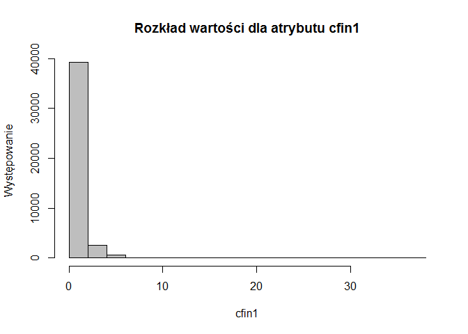<!-- -->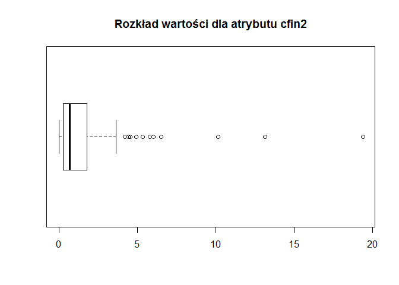<!-- -->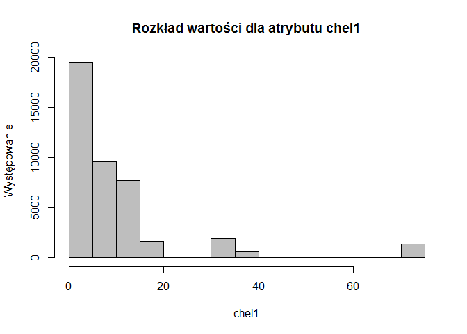<!-- -->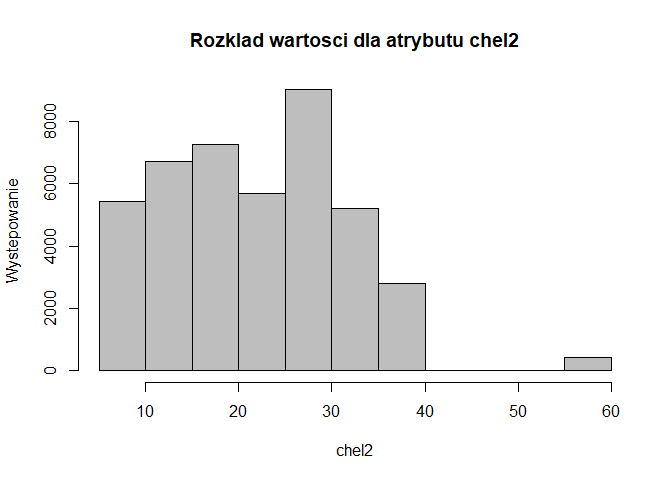<!-- -->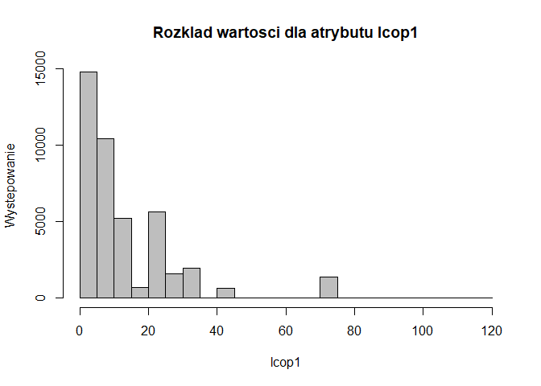<!-- -->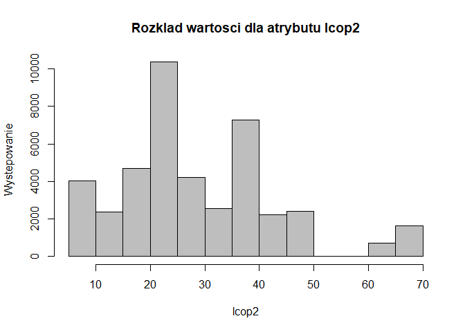<!-- -->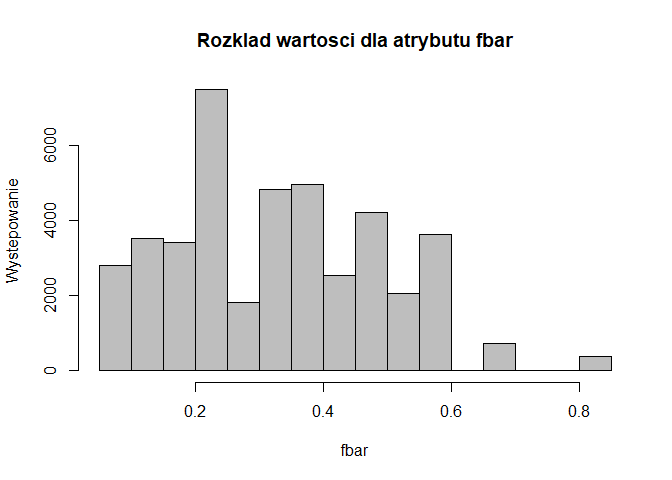<!-- -->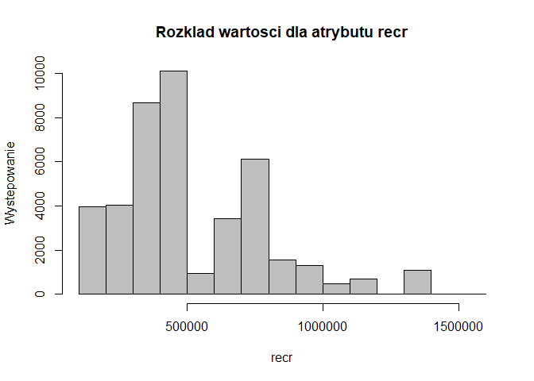<!-- -->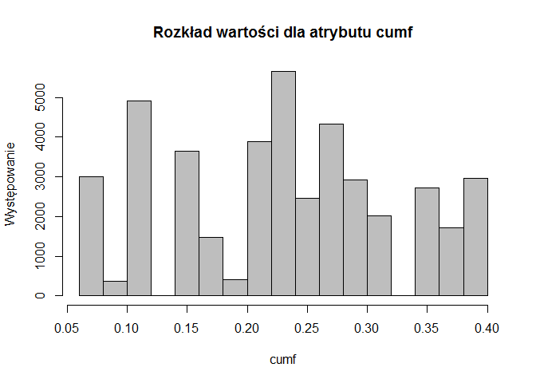<!-- -->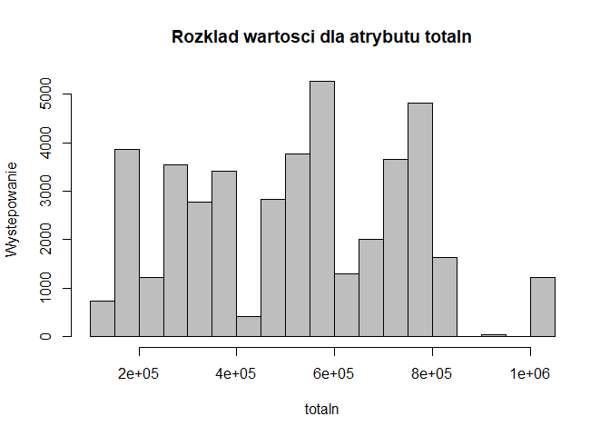<!-- -->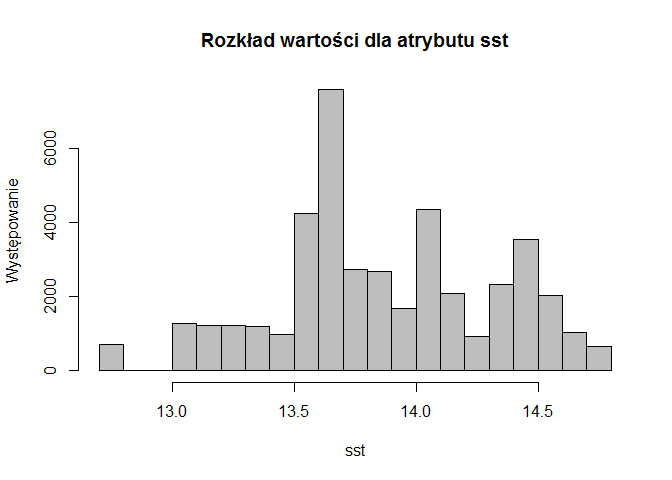<!-- -->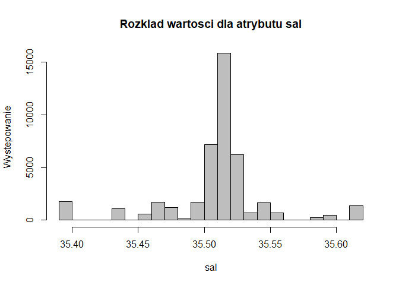<!-- -->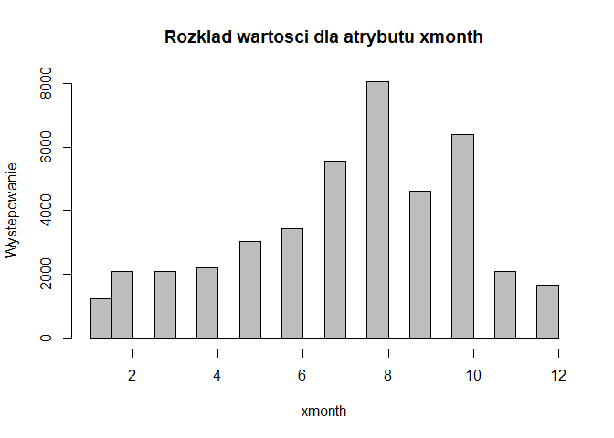<!-- -->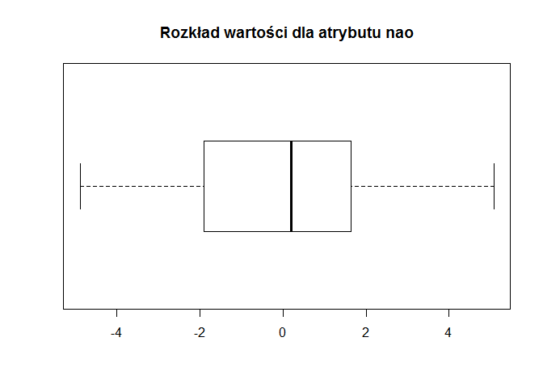<!-- -->

## Korelację pomiędzy atrybutami

Korelacja pomiędzy poszczególnymi atrybutami, a długością śledzia

    ##       cfin1       cfin2       chel1       chel2       lcop1       lcop2 
    ##  0.08122553  0.09832515  0.22091226 -0.01430766  0.23775402  0.04894328 
    ##        fbar        recr        cumf      totaln         sst         sal 
    ##  0.25697135 -0.01034244  0.01152544  0.09605811 -0.45167059  0.03223550 
    ##      xmonth         nao 
    ##  0.01371195 -0.25684475

## Zmiana rozmiarów śledzi w czasie

    ## `geom_smooth()` using method = 'gam' and formula 'y ~ s(x, bs = "cs")'

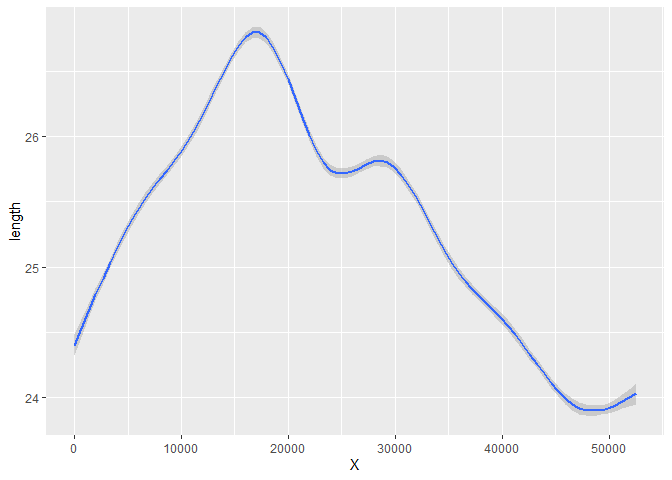<!-- -->

## Prognoza rozmiarów śledzi

## Analiza modelu regresji

## Including Plots

You can also embed plots, for example:

<!-- -->

Note that the `echo = FALSE` parameter was added to the code chunk to
prevent printing of the R code that generated the plot.
