-   [Wyniki analizy](#wyniki-analizy)
-   [Wykorzystane biblioteki](#wykorzystane-biblioteki)
-   [Powtarzalność danych](#powtarzalność-danych)
-   [Wczytanie danych](#wczytanie-danych)
-   [Czeyszczenie zbioru](#czeyszczenie-zbioru)
-   [Charaktrystyki zbioru](#charaktrystyki-zbioru)
-   [Analiza atrybutów](#analiza-atrybutów)
-   [Korelację pomiędzy atrybutami](#korelację-pomiędzy-atrybutami)
-   [Zmiana rozmiarów śledzi w
    czasie](#zmiana-rozmiarów-śledzi-w-czasie)
-   [Prognoza rozmiarów śledzi](#prognoza-rozmiarów-śledzi)
-   [Analiza modelu regresji](#analiza-modelu-regresji)

Wyniki analizy
--------------

Analiza dostępnych danych wykazała, że nie da się wykazać ścisłej
relacji pomiędzy jednym atrybutem, a wielkością śledzi. Na wykresie
zmiany wielkosci śledzi w czasie można zaobserwować, że karłowatość
objawiała się wcześniej. Na przestrzeni zbadanych 60 lat wielkość śledzi
rosła, by po inicjalnym okresie wzrostu zaczą maleć. W efekcie końcowym
wielkość śledzi jest mniejsza niż na początku prowadzenia badań. Można
jednak zauważyć tendencję wzrostowom w ramch ostatnich połowów. Można
jednak zaobserwować pewną korelację pomiędzy wzrostem i spadkiem
stężenia niektórych gatunków planktonu, a wielkością śledzi.

Wykorzystane biblioteki
-----------------------

    ## corrplot 0.84 loaded

    ## 
    ## Attaching package: 'plotly'

    ## The following object is masked from 'package:ggplot2':
    ## 
    ##     last_plot

    ## The following object is masked from 'package:stats':
    ## 
    ##     filter

    ## The following object is masked from 'package:graphics':
    ## 
    ##     layout

    ## Loading required package: lattice

    ## randomForest 4.6-14

    ## Type rfNews() to see new features/changes/bug fixes.

    ## 
    ## Attaching package: 'randomForest'

    ## The following object is masked from 'package:ggplot2':
    ## 
    ##     margin

Powtarzalność danych
--------------------

``` r
set.seed(1)
```

Wczytanie danych
----------------

Wczytanie daych odbywa się poprzez załadowanie informacji z pliku
sledzie.csv. Plik ten jest załączony do repozytorium.

``` r
data = read.csv("sledzie.csv", TRUE, sep = ',')
```

Czeyszczenie zbioru
-------------------

Czyszczenie zbioru przebiega na zasadzie zamienienia symboli ?
występujących w pliku na wartość NA. Następnie tworzymy nowy zbiór, w
którym pomijamy wszystkie rekordy posiadające w którejkolwiek kolumnie
wartość NA. Po wykoaniu tej operacji należy przekonwertować typy kolumn
na numeryczne.

``` r
data[data=="?"]<-NA
df <- na.omit(data)
cols.num <- c("cfin1","cfin2","chel1","chel2","lcop1","lcop2","sst")
df[cols.num] <- sapply(df[cols.num],function(x) as.numeric(as.character(x)))
clear <- na.omit(df)
```

Charaktrystyki zbioru
---------------------

### Kolumny

    ##  [1] "X"      "length" "cfin1"  "cfin2"  "chel1"  "chel2"  "lcop1"  "lcop2" 
    ##  [9] "fbar"   "recr"   "cumf"   "totaln" "sst"    "sal"    "xmonth" "nao"

-   X: liczba porządkowa;
-   length: długość złowionego śledzia \[cm\];
-   cfin1: dostępność planktonu \[zagęszczenie Calanus finmarchicus gat.
    1\];
-   cfin2: dostępność planktonu \[zagęszczenie Calanus finmarchicus gat.
    2\];
-   chel1: dostępność planktonu \[zagęszczenie Calanus helgolandicus
    gat. 1\];
-   chel2: dostępność planktonu \[zagęszczenie Calanus helgolandicus
    gat. 2\];
-   lcop1: dostępność planktonu \[zagęszczenie widłonogów gat. 1\];
-   lcop2: dostępność planktonu \[zagęszczenie widłonogów gat. 2\];
-   fbar: natężenie połowów w regionie \[ułamek pozostawionego
    narybku\];
-   recr: roczny narybek \[liczba śledzi\];
-   cumf: łączne roczne natężenie połowów w regionie \[ułamek
    pozostawionego narybku\];
-   totaln: łączna liczba ryb złowionych w ramach połowu \[liczba
    śledzi\];
-   sst: temperatura przy powierzchni wody \[°C\];
-   sal: poziom zasolenia wody \[Knudsen ppt\];
-   xmonth: miesiąc połowu \[numer miesiąca\];
-   nao: oscylacja północnoatlantycka \[mb\].

### Wielkość zbioru przed wyczyszczeniem danych

    ## [1] 52582

### Wielkość zbioru po wyczyszczeniem danych

    ## [1] 42488

### Analiza wartości poszczególnych kolumn czystego zbioru

    ##      length         cfin1             cfin2             chel1       
    ##  Min.   :19.0   Min.   : 0.0000   Min.   : 0.0000   Min.   : 0.000  
    ##  1st Qu.:24.0   1st Qu.: 0.0000   1st Qu.: 0.2778   1st Qu.: 2.469  
    ##  Median :25.5   Median : 0.1111   Median : 0.7012   Median : 5.750  
    ##  Mean   :25.3   Mean   : 0.4457   Mean   : 2.0269   Mean   :10.016  
    ##  3rd Qu.:26.5   3rd Qu.: 0.3333   3rd Qu.: 1.7936   3rd Qu.:11.500  
    ##  Max.   :32.5   Max.   :37.6667   Max.   :19.3958   Max.   :75.000  
    ##      chel2            lcop1              lcop2             fbar       
    ##  Min.   : 5.238   Min.   :  0.3074   Min.   : 7.849   Min.   :0.0680  
    ##  1st Qu.:13.427   1st Qu.:  2.5479   1st Qu.:17.808   1st Qu.:0.2270  
    ##  Median :21.435   Median :  7.0000   Median :24.859   Median :0.3320  
    ##  Mean   :21.197   Mean   : 12.8386   Mean   :28.396   Mean   :0.3306  
    ##  3rd Qu.:27.193   3rd Qu.: 21.2315   3rd Qu.:37.232   3rd Qu.:0.4650  
    ##  Max.   :57.706   Max.   :115.5833   Max.   :68.736   Max.   :0.8490  
    ##       recr              cumf             totaln             sst       
    ##  Min.   : 140515   Min.   :0.06833   Min.   : 144137   Min.   :12.77  
    ##  1st Qu.: 360061   1st Qu.:0.14809   1st Qu.: 306068   1st Qu.:13.60  
    ##  Median : 421391   Median :0.23191   Median : 539558   Median :13.86  
    ##  Mean   : 519877   Mean   :0.22987   Mean   : 515082   Mean   :13.87  
    ##  3rd Qu.: 724151   3rd Qu.:0.29803   3rd Qu.: 730351   3rd Qu.:14.16  
    ##  Max.   :1565890   Max.   :0.39801   Max.   :1015595   Max.   :14.73  
    ##       sal            xmonth            nao          
    ##  Min.   :35.40   Min.   : 1.000   Min.   :-4.89000  
    ##  1st Qu.:35.51   1st Qu.: 5.000   1st Qu.:-1.90000  
    ##  Median :35.51   Median : 8.000   Median : 0.20000  
    ##  Mean   :35.51   Mean   : 7.252   Mean   :-0.09642  
    ##  3rd Qu.:35.52   3rd Qu.: 9.000   3rd Qu.: 1.63000  
    ##  Max.   :35.61   Max.   :12.000   Max.   : 5.08000

Analiza atrybutów
-----------------

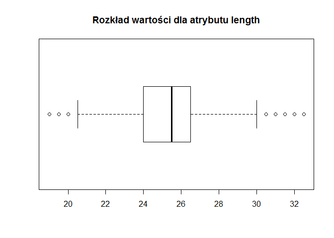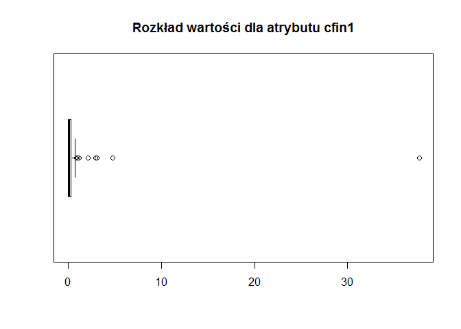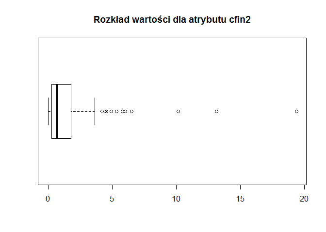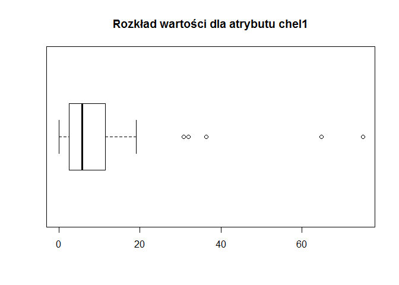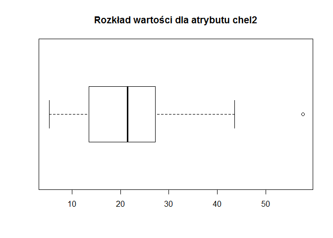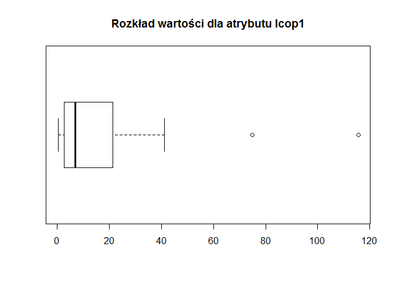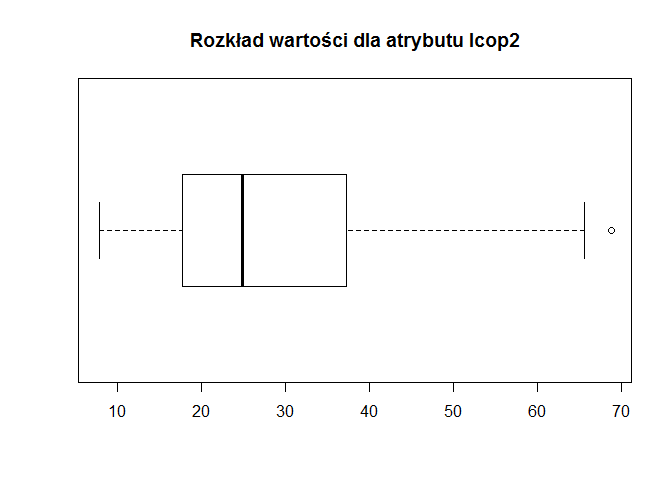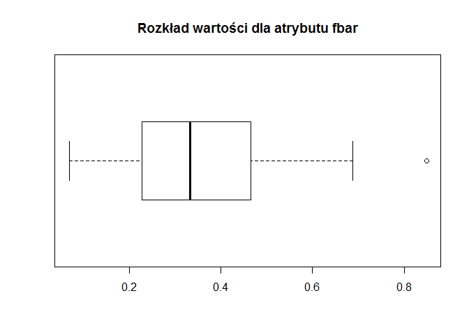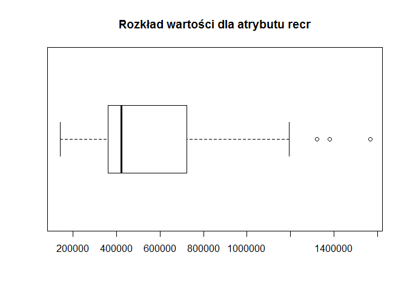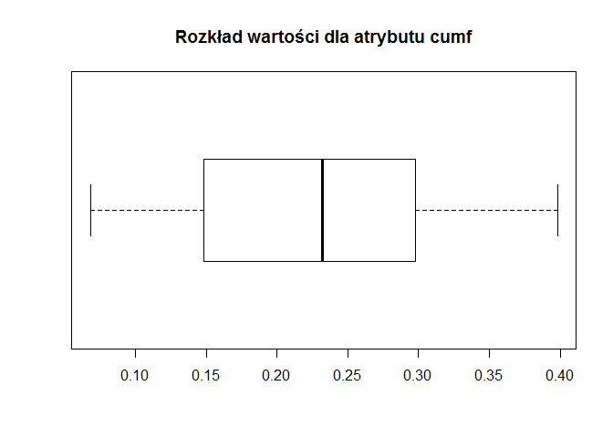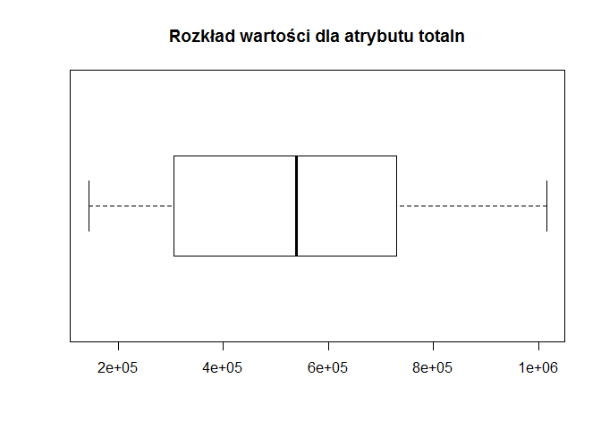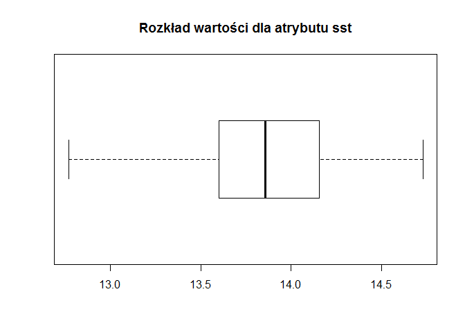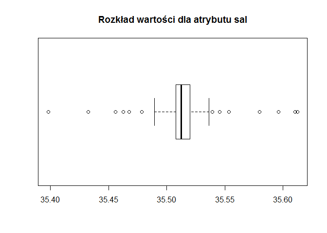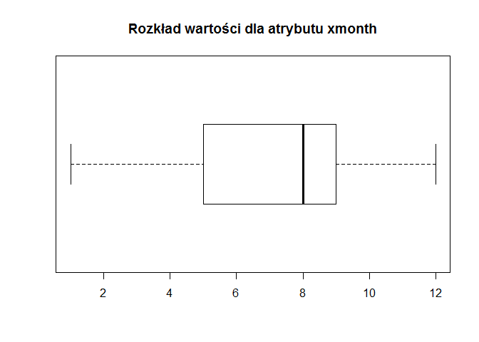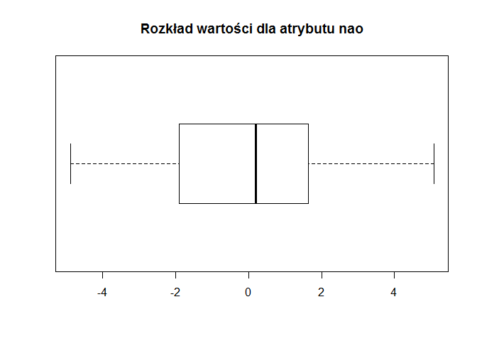

Korelację pomiędzy atrybutami
-----------------------------

Korelacja pomiędzy poszczególnymi atrybutami, a długością śledzia

### Korelacja pomiędzy wielkością a pozostałymi atrybutami

    ##       cfin1       cfin2       chel1       chel2       lcop1       lcop2 
    ##  0.08122553  0.09832515  0.22091226 -0.01430766  0.23775402  0.04894328 
    ##        fbar        recr        cumf      totaln         sst         sal 
    ##  0.25697135 -0.01034244  0.01152544  0.09605811 -0.45167059  0.03223550 
    ##      xmonth         nao 
    ##  0.01371195 -0.25684475

Największą wartość bezwzględną posiada korelacja pomiędzy długością
śledzia, a temperaturą przy powierzchni. Według badania te wartości są
skorelowane ujemnie, a stopień korelacji jest słaby.

### Macierz korelacji wszystkich atrybutów

``` r
corrplot(Matrix, method = "square")
```

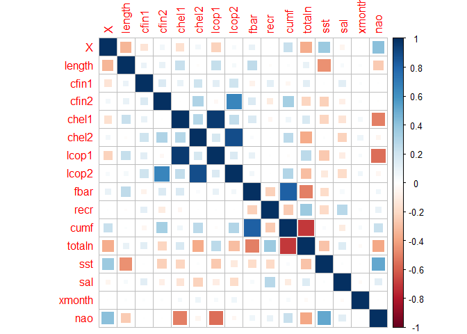

Zmiana rozmiarów śledzi w czasie
--------------------------------

### Interaktywny wykres

    ## `geom_smooth()` using method = 'gam' and formula 'y ~ s(x, bs = "cs")'

<!--html_preserve-->

<script type="application/json" data-for="htmlwidget-f843a680a1fcd62a0dd1">{"x":{"data":[{"x":[1,666.556962025316,1332.11392405063,1997.67088607595,2663.22784810127,3328.78481012658,3994.3417721519,4659.89873417722,5325.45569620253,5991.01265822785,6656.56962025316,7322.12658227848,7987.6835443038,8653.24050632911,9318.79746835443,9984.35443037975,10649.9113924051,11315.4683544304,11981.0253164557,12646.582278481,13312.1392405063,13977.6962025316,14643.253164557,15308.8101265823,15974.3670886076,16639.9240506329,17305.4810126582,17971.0379746835,18636.5949367089,19302.1518987342,19967.7088607595,20633.2658227848,21298.8227848101,21964.3797468354,22629.9367088608,23295.4936708861,23961.0506329114,24626.6075949367,25292.164556962,25957.7215189873,26623.2784810127,27288.835443038,27954.3924050633,28619.9493670886,29285.5063291139,29951.0632911392,30616.6202531646,31282.1772151899,31947.7341772152,32613.2911392405,33278.8481012658,33944.4050632911,34609.9620253165,35275.5189873418,35941.0759493671,36606.6329113924,37272.1898734177,37937.746835443,38603.3037974684,39268.8607594937,39934.417721519,40599.9746835443,41265.5316455696,41931.0886075949,42596.6455696203,43262.2025316456,43927.7594936709,44593.3164556962,45258.8734177215,45924.4303797468,46589.9873417722,47255.5443037975,47921.1012658228,48586.6582278481,49252.2151898734,49917.7721518987,50583.3291139241,51248.8860759494,51914.4430379747,52580],"y":[24.4019532510441,24.5325523161891,24.6620464666224,24.7893307876321,24.9133003645067,25.0328502825342,25.146875627003,25.2542714832013,25.3539329364174,25.4447598650459,25.5266855372574,25.6019573803281,25.673137268706,25.7427870768391,25.8134686791754,25.8877439501628,25.9681747642494,26.0573229958832,26.1577084919278,26.2686309108767,26.3839491964048,26.4969974956325,26.6011099556803,26.6896207236685,26.7558639467177,26.7931737719481,26.7948843464803,26.7547818619542,26.6749275998764,26.5646268460207,26.4334295680843,26.2908857337644,26.1465453107581,26.0099582667627,25.8906745694753,25.7982441865932,25.7407730183256,25.7155644203795,25.7150286813001,25.7315518874136,25.7575201250461,25.7853194805236,25.8073360401722,25.815955890318,25.8035688872002,25.7654316457746,25.7047716610015,25.6261906773956,25.534290439472,25.4336726917456,25.3289391787313,25.224691644944,25.1255318348987,25.0360043460452,24.9579447733706,24.8893584021572,24.8279606410827,24.7714668988244,24.71759258406,24.6640531054669,24.6085638717226,24.5488402915047,24.4827493288114,24.4106827667194,24.3351165039079,24.2585888357364,24.1836380575641,24.1128024647505,24.0486203526547,23.9936300166362,23.9503697520542,23.9210709567113,23.9053589102395,23.901544092171,23.907926898448,23.9228077250131,23.9444869678086,23.9712650227769,24.0014422858604,24.0333191530015],"text":["X:     1.000<br />length: 24.40195","X:   666.557<br />length: 24.53255","X:  1332.114<br />length: 24.66205","X:  1997.671<br />length: 24.78933","X:  2663.228<br />length: 24.91330","X:  3328.785<br />length: 25.03285","X:  3994.342<br />length: 25.14688","X:  4659.899<br />length: 25.25427","X:  5325.456<br />length: 25.35393","X:  5991.013<br />length: 25.44476","X:  6656.570<br />length: 25.52669","X:  7322.127<br />length: 25.60196","X:  7987.684<br />length: 25.67314","X:  8653.241<br />length: 25.74279","X:  9318.797<br />length: 25.81347","X:  9984.354<br />length: 25.88774","X: 10649.911<br />length: 25.96817","X: 11315.468<br />length: 26.05732","X: 11981.025<br />length: 26.15771","X: 12646.582<br />length: 26.26863","X: 13312.139<br />length: 26.38395","X: 13977.696<br />length: 26.49700","X: 14643.253<br />length: 26.60111","X: 15308.810<br />length: 26.68962","X: 15974.367<br />length: 26.75586","X: 16639.924<br />length: 26.79317","X: 17305.481<br />length: 26.79488","X: 17971.038<br />length: 26.75478","X: 18636.595<br />length: 26.67493","X: 19302.152<br />length: 26.56463","X: 19967.709<br />length: 26.43343","X: 20633.266<br />length: 26.29089","X: 21298.823<br />length: 26.14655","X: 21964.380<br />length: 26.00996","X: 22629.937<br />length: 25.89067","X: 23295.494<br />length: 25.79824","X: 23961.051<br />length: 25.74077","X: 24626.608<br />length: 25.71556","X: 25292.165<br />length: 25.71503","X: 25957.722<br />length: 25.73155","X: 26623.278<br />length: 25.75752","X: 27288.835<br />length: 25.78532","X: 27954.392<br />length: 25.80734","X: 28619.949<br />length: 25.81596","X: 29285.506<br />length: 25.80357","X: 29951.063<br />length: 25.76543","X: 30616.620<br />length: 25.70477","X: 31282.177<br />length: 25.62619","X: 31947.734<br />length: 25.53429","X: 32613.291<br />length: 25.43367","X: 33278.848<br />length: 25.32894","X: 33944.405<br />length: 25.22469","X: 34609.962<br />length: 25.12553","X: 35275.519<br />length: 25.03600","X: 35941.076<br />length: 24.95794","X: 36606.633<br />length: 24.88936","X: 37272.190<br />length: 24.82796","X: 37937.747<br />length: 24.77147","X: 38603.304<br />length: 24.71759","X: 39268.861<br />length: 24.66405","X: 39934.418<br />length: 24.60856","X: 40599.975<br />length: 24.54884","X: 41265.532<br />length: 24.48275","X: 41931.089<br />length: 24.41068","X: 42596.646<br />length: 24.33512","X: 43262.203<br />length: 24.25859","X: 43927.759<br />length: 24.18364","X: 44593.316<br />length: 24.11280","X: 45258.873<br />length: 24.04862","X: 45924.430<br />length: 23.99363","X: 46589.987<br />length: 23.95037","X: 47255.544<br />length: 23.92107","X: 47921.101<br />length: 23.90536","X: 48586.658<br />length: 23.90154","X: 49252.215<br />length: 23.90793","X: 49917.772<br />length: 23.92281","X: 50583.329<br />length: 23.94449","X: 51248.886<br />length: 23.97127","X: 51914.443<br />length: 24.00144","X: 52580.000<br />length: 24.03332"],"type":"scatter","mode":"lines","name":"fitted values","line":{"width":3.77952755905512,"color":"rgba(51,102,255,1)","dash":"solid"},"hoveron":"points","showlegend":false,"xaxis":"x","yaxis":"y","hoverinfo":"text","frame":null},{"x":[1,666.556962025316,1332.11392405063,1997.67088607595,2663.22784810127,3328.78481012658,3994.3417721519,4659.89873417722,5325.45569620253,5991.01265822785,6656.56962025316,7322.12658227848,7987.6835443038,8653.24050632911,9318.79746835443,9984.35443037975,10649.9113924051,11315.4683544304,11981.0253164557,12646.582278481,13312.1392405063,13977.6962025316,14643.253164557,15308.8101265823,15974.3670886076,16639.9240506329,17305.4810126582,17971.0379746835,18636.5949367089,19302.1518987342,19967.7088607595,20633.2658227848,21298.8227848101,21964.3797468354,22629.9367088608,23295.4936708861,23961.0506329114,24626.6075949367,25292.164556962,25957.7215189873,26623.2784810127,27288.835443038,27954.3924050633,28619.9493670886,29285.5063291139,29951.0632911392,30616.6202531646,31282.1772151899,31947.7341772152,32613.2911392405,33278.8481012658,33944.4050632911,34609.9620253165,35275.5189873418,35941.0759493671,36606.6329113924,37272.1898734177,37937.746835443,38603.3037974684,39268.8607594937,39934.417721519,40599.9746835443,41265.5316455696,41931.0886075949,42596.6455696203,43262.2025316456,43927.7594936709,44593.3164556962,45258.8734177215,45924.4303797468,46589.9873417722,47255.5443037975,47921.1012658228,48586.6582278481,49252.2151898734,49917.7721518987,50583.3291139241,51248.8860759494,51914.4430379747,52580,52580,52580,51914.4430379747,51248.8860759494,50583.3291139241,49917.7721518987,49252.2151898734,48586.6582278481,47921.1012658228,47255.5443037975,46589.9873417722,45924.4303797468,45258.8734177215,44593.3164556962,43927.7594936709,43262.2025316456,42596.6455696203,41931.0886075949,41265.5316455696,40599.9746835443,39934.417721519,39268.8607594937,38603.3037974684,37937.746835443,37272.1898734177,36606.6329113924,35941.0759493671,35275.5189873418,34609.9620253165,33944.4050632911,33278.8481012658,32613.2911392405,31947.7341772152,31282.1772151899,30616.6202531646,29951.0632911392,29285.5063291139,28619.9493670886,27954.3924050633,27288.835443038,26623.2784810127,25957.7215189873,25292.164556962,24626.6075949367,23961.0506329114,23295.4936708861,22629.9367088608,21964.3797468354,21298.8227848101,20633.2658227848,19967.7088607595,19302.1518987342,18636.5949367089,17971.0379746835,17305.4810126582,16639.9240506329,15974.3670886076,15308.8101265823,14643.253164557,13977.6962025316,13312.1392405063,12646.582278481,11981.0253164557,11315.4683544304,10649.9113924051,9984.35443037975,9318.79746835443,8653.24050632911,7987.6835443038,7322.12658227848,6656.56962025316,5991.01265822785,5325.45569620253,4659.89873417722,3994.3417721519,3328.78481012658,2663.22784810127,1997.67088607595,1332.11392405063,666.556962025316,1,1],"y":[24.3213505806142,24.4660467607603,24.6079331660004,24.7447933568782,24.8743825920852,24.9952961004595,25.1076889137359,25.2124743046974,25.3102034601149,25.4007897164008,25.4843531831372,25.5623104196919,25.6360475828745,25.7069681473019,25.777019188267,25.8491004361879,25.9268305387874,26.013987014037,26.1140966082883,26.2266668620608,26.3446479268541,26.4601343955766,26.5652848514478,26.6528957257801,26.7167703332993,26.7513921998854,26.7513419802871,26.7113678825203,26.6334500876783,26.5258619982821,26.3968883627137,26.2549867668717,26.1093788575206,25.970283172135,25.8484694304143,25.7547043900881,25.6979019606081,25.6749512984869,25.6771177693093,25.6954980964749,25.721524459534,25.7475463954289,25.7668569352398,25.7731267663118,25.7599118001151,25.722979656198,25.664814465988,25.5888131748308,25.4983336268608,25.3972337270746,25.2903587955975,25.1833668132061,25.082134946619,24.9922806430304,24.9158400381771,24.8499161972098,24.7910019262624,24.7356373967778,24.6809716988695,24.6251490016311,24.5670114708077,24.5055190020813,24.4395068917804,24.369301184682,24.2963955439214,24.2221048835114,24.1478731590501,24.0758416299532,24.0091226129045,23.9514105767166,23.9064390712752,23.8773068309916,23.8634949119032,23.8623056718458,23.8703752244755,23.883953817658,23.9000380956978,23.917214240464,23.9349369966978,23.9526356879908,23.9526356879908,24.1140026180123,24.067947575023,24.0253158050898,23.9889358399194,23.9616616323681,23.9454785724205,23.9407825124961,23.9472229085758,23.964835082431,23.9943004328333,24.0358494565558,24.0881180924049,24.1497632995477,24.2194029560782,24.2950727879614,24.3738374638945,24.4520643487567,24.5259917658423,24.5921615809281,24.6501162726376,24.7029572093027,24.7542134692505,24.8072964008711,24.8649193559029,24.9288006071047,25.0000495085641,25.0797280490601,25.1689287231784,25.266016476682,25.3675195618652,25.4701116564167,25.5702472520833,25.6635681799604,25.7447288560149,25.8078836353513,25.8472259742853,25.8587850143242,25.8478151451046,25.8230925656182,25.7935157905581,25.7676056783524,25.7529395932909,25.7561775422721,25.7836440760431,25.8417839830982,25.9328797085364,26.0496333613904,26.1837117639956,26.3267847006571,26.4699707734548,26.6033916937593,26.7164051120744,26.7981958413881,26.8384267126735,26.8349553440109,26.794957560136,26.7263457215569,26.6369350599128,26.5338605956884,26.4232504659554,26.3105949596926,26.2013203755672,26.1006589777293,26.0095189897114,25.9263874641377,25.8499181700837,25.7786060063763,25.7102269545375,25.6416043409643,25.5690178913776,25.4887300136911,25.3976624127198,25.2960686617052,25.1860623402701,25.0704044646089,24.9522181369281,24.8338682183861,24.7161597672444,24.5990578716179,24.4825559214739,24.3213505806142],"text":["X:     1.000<br />length: 24.40195","X:   666.557<br />length: 24.53255","X:  1332.114<br />length: 24.66205","X:  1997.671<br />length: 24.78933","X:  2663.228<br />length: 24.91330","X:  3328.785<br />length: 25.03285","X:  3994.342<br />length: 25.14688","X:  4659.899<br />length: 25.25427","X:  5325.456<br />length: 25.35393","X:  5991.013<br />length: 25.44476","X:  6656.570<br />length: 25.52669","X:  7322.127<br />length: 25.60196","X:  7987.684<br />length: 25.67314","X:  8653.241<br />length: 25.74279","X:  9318.797<br />length: 25.81347","X:  9984.354<br />length: 25.88774","X: 10649.911<br />length: 25.96817","X: 11315.468<br />length: 26.05732","X: 11981.025<br />length: 26.15771","X: 12646.582<br />length: 26.26863","X: 13312.139<br />length: 26.38395","X: 13977.696<br />length: 26.49700","X: 14643.253<br />length: 26.60111","X: 15308.810<br />length: 26.68962","X: 15974.367<br />length: 26.75586","X: 16639.924<br />length: 26.79317","X: 17305.481<br />length: 26.79488","X: 17971.038<br />length: 26.75478","X: 18636.595<br />length: 26.67493","X: 19302.152<br />length: 26.56463","X: 19967.709<br />length: 26.43343","X: 20633.266<br />length: 26.29089","X: 21298.823<br />length: 26.14655","X: 21964.380<br />length: 26.00996","X: 22629.937<br />length: 25.89067","X: 23295.494<br />length: 25.79824","X: 23961.051<br />length: 25.74077","X: 24626.608<br />length: 25.71556","X: 25292.165<br />length: 25.71503","X: 25957.722<br />length: 25.73155","X: 26623.278<br />length: 25.75752","X: 27288.835<br />length: 25.78532","X: 27954.392<br />length: 25.80734","X: 28619.949<br />length: 25.81596","X: 29285.506<br />length: 25.80357","X: 29951.063<br />length: 25.76543","X: 30616.620<br />length: 25.70477","X: 31282.177<br />length: 25.62619","X: 31947.734<br />length: 25.53429","X: 32613.291<br />length: 25.43367","X: 33278.848<br />length: 25.32894","X: 33944.405<br />length: 25.22469","X: 34609.962<br />length: 25.12553","X: 35275.519<br />length: 25.03600","X: 35941.076<br />length: 24.95794","X: 36606.633<br />length: 24.88936","X: 37272.190<br />length: 24.82796","X: 37937.747<br />length: 24.77147","X: 38603.304<br />length: 24.71759","X: 39268.861<br />length: 24.66405","X: 39934.418<br />length: 24.60856","X: 40599.975<br />length: 24.54884","X: 41265.532<br />length: 24.48275","X: 41931.089<br />length: 24.41068","X: 42596.646<br />length: 24.33512","X: 43262.203<br />length: 24.25859","X: 43927.759<br />length: 24.18364","X: 44593.316<br />length: 24.11280","X: 45258.873<br />length: 24.04862","X: 45924.430<br />length: 23.99363","X: 46589.987<br />length: 23.95037","X: 47255.544<br />length: 23.92107","X: 47921.101<br />length: 23.90536","X: 48586.658<br />length: 23.90154","X: 49252.215<br />length: 23.90793","X: 49917.772<br />length: 23.92281","X: 50583.329<br />length: 23.94449","X: 51248.886<br />length: 23.97127","X: 51914.443<br />length: 24.00144","X: 52580.000<br />length: 24.03332","X: 52580.000<br />length: 24.03332","X: 52580.000<br />length: 24.03332","X: 51914.443<br />length: 24.00144","X: 51248.886<br />length: 23.97127","X: 50583.329<br />length: 23.94449","X: 49917.772<br />length: 23.92281","X: 49252.215<br />length: 23.90793","X: 48586.658<br />length: 23.90154","X: 47921.101<br />length: 23.90536","X: 47255.544<br />length: 23.92107","X: 46589.987<br />length: 23.95037","X: 45924.430<br />length: 23.99363","X: 45258.873<br />length: 24.04862","X: 44593.316<br />length: 24.11280","X: 43927.759<br />length: 24.18364","X: 43262.203<br />length: 24.25859","X: 42596.646<br />length: 24.33512","X: 41931.089<br />length: 24.41068","X: 41265.532<br />length: 24.48275","X: 40599.975<br />length: 24.54884","X: 39934.418<br />length: 24.60856","X: 39268.861<br />length: 24.66405","X: 38603.304<br />length: 24.71759","X: 37937.747<br />length: 24.77147","X: 37272.190<br />length: 24.82796","X: 36606.633<br />length: 24.88936","X: 35941.076<br />length: 24.95794","X: 35275.519<br />length: 25.03600","X: 34609.962<br />length: 25.12553","X: 33944.405<br />length: 25.22469","X: 33278.848<br />length: 25.32894","X: 32613.291<br />length: 25.43367","X: 31947.734<br />length: 25.53429","X: 31282.177<br />length: 25.62619","X: 30616.620<br />length: 25.70477","X: 29951.063<br />length: 25.76543","X: 29285.506<br />length: 25.80357","X: 28619.949<br />length: 25.81596","X: 27954.392<br />length: 25.80734","X: 27288.835<br />length: 25.78532","X: 26623.278<br />length: 25.75752","X: 25957.722<br />length: 25.73155","X: 25292.165<br />length: 25.71503","X: 24626.608<br />length: 25.71556","X: 23961.051<br />length: 25.74077","X: 23295.494<br />length: 25.79824","X: 22629.937<br />length: 25.89067","X: 21964.380<br />length: 26.00996","X: 21298.823<br />length: 26.14655","X: 20633.266<br />length: 26.29089","X: 19967.709<br />length: 26.43343","X: 19302.152<br />length: 26.56463","X: 18636.595<br />length: 26.67493","X: 17971.038<br />length: 26.75478","X: 17305.481<br />length: 26.79488","X: 16639.924<br />length: 26.79317","X: 15974.367<br />length: 26.75586","X: 15308.810<br />length: 26.68962","X: 14643.253<br />length: 26.60111","X: 13977.696<br />length: 26.49700","X: 13312.139<br />length: 26.38395","X: 12646.582<br />length: 26.26863","X: 11981.025<br />length: 26.15771","X: 11315.468<br />length: 26.05732","X: 10649.911<br />length: 25.96817","X:  9984.354<br />length: 25.88774","X:  9318.797<br />length: 25.81347","X:  8653.241<br />length: 25.74279","X:  7987.684<br />length: 25.67314","X:  7322.127<br />length: 25.60196","X:  6656.570<br />length: 25.52669","X:  5991.013<br />length: 25.44476","X:  5325.456<br />length: 25.35393","X:  4659.899<br />length: 25.25427","X:  3994.342<br />length: 25.14688","X:  3328.785<br />length: 25.03285","X:  2663.228<br />length: 24.91330","X:  1997.671<br />length: 24.78933","X:  1332.114<br />length: 24.66205","X:   666.557<br />length: 24.53255","X:     1.000<br />length: 24.40195","X:     1.000<br />length: 24.40195"],"type":"scatter","mode":"lines","line":{"width":3.77952755905512,"color":"transparent","dash":"solid"},"fill":"toself","fillcolor":"rgba(153,153,153,0.4)","hoveron":"points","hoverinfo":"x+y","showlegend":false,"xaxis":"x","yaxis":"y","frame":null}],"layout":{"margin":{"t":26.2283105022831,"r":7.30593607305936,"b":40.1826484018265,"l":37.2602739726027},"plot_bgcolor":"rgba(235,235,235,1)","paper_bgcolor":"rgba(255,255,255,1)","font":{"color":"rgba(0,0,0,1)","family":"","size":14.6118721461187},"xaxis":{"domain":[0,1],"automargin":true,"type":"linear","autorange":false,"range":[-2627.95,55208.95],"tickmode":"array","ticktext":["0","10000","20000","30000","40000","50000"],"tickvals":[0,10000,20000,30000,40000,50000],"categoryorder":"array","categoryarray":["0","10000","20000","30000","40000","50000"],"nticks":null,"ticks":"outside","tickcolor":"rgba(51,51,51,1)","ticklen":3.65296803652968,"tickwidth":0.66417600664176,"showticklabels":true,"tickfont":{"color":"rgba(77,77,77,1)","family":"","size":11.689497716895},"tickangle":-0,"showline":false,"linecolor":null,"linewidth":0,"showgrid":true,"gridcolor":"rgba(255,255,255,1)","gridwidth":0.66417600664176,"zeroline":false,"anchor":"y","title":{"text":"X","font":{"color":"rgba(0,0,0,1)","family":"","size":14.6118721461187}},"hoverformat":".2f"},"yaxis":{"domain":[0,1],"automargin":true,"type":"linear","autorange":false,"range":[23.7134996198044,26.9872327647149],"tickmode":"array","ticktext":["24","25","26"],"tickvals":[24,25,26],"categoryorder":"array","categoryarray":["24","25","26"],"nticks":null,"ticks":"outside","tickcolor":"rgba(51,51,51,1)","ticklen":3.65296803652968,"tickwidth":0.66417600664176,"showticklabels":true,"tickfont":{"color":"rgba(77,77,77,1)","family":"","size":11.689497716895},"tickangle":-0,"showline":false,"linecolor":null,"linewidth":0,"showgrid":true,"gridcolor":"rgba(255,255,255,1)","gridwidth":0.66417600664176,"zeroline":false,"anchor":"x","title":{"text":"length","font":{"color":"rgba(0,0,0,1)","family":"","size":14.6118721461187}},"hoverformat":".2f"},"shapes":[{"type":"rect","fillcolor":null,"line":{"color":null,"width":0,"linetype":[]},"yref":"paper","xref":"paper","x0":0,"x1":1,"y0":0,"y1":1}],"showlegend":false,"legend":{"bgcolor":"rgba(255,255,255,1)","bordercolor":"transparent","borderwidth":1.88976377952756,"font":{"color":"rgba(0,0,0,1)","family":"","size":11.689497716895}},"hovermode":"closest","barmode":"relative"},"config":{"doubleClick":"reset","showSendToCloud":false},"source":"A","attrs":{"16d868a939ee":{"x":{},"y":{},"type":"scatter"}},"cur_data":"16d868a939ee","visdat":{"16d868a939ee":["function (y) ","x"]},"highlight":{"on":"plotly_click","persistent":false,"dynamic":false,"selectize":false,"opacityDim":0.2,"selected":{"opacity":1},"debounce":0},"shinyEvents":["plotly_hover","plotly_click","plotly_selected","plotly_relayout","plotly_brushed","plotly_brushing","plotly_clickannotation","plotly_doubleclick","plotly_deselect","plotly_afterplot","plotly_sunburstclick"],"base_url":"https://plot.ly"},"evals":[],"jsHooks":[]}</script>
<!--/html_preserve-->

### Standardowy wykres

    ## `geom_smooth()` using method = 'gam' and formula 'y ~ s(x, bs = "cs")'


Prognoza rozmiarów śledzi
-------------------------

``` r
cut <- clear %>% select(length, cfin1, cfin2, chel1, chel2, lcop1, lcop2, fbar, recr, cumf, totaln, sst, sal, nao)
split <- createDataPartition(y=cut$length, p=.8, list=FALSE)
train <- cut[split, ]
test <- cut[-split, ]

tGrid <- expand.grid(mtry = 1:7)
ctrl <- trainControl(method = "repeatedcv", number = 6, repeats = 3)
fit <- train(length ~ .,
             data = train,
             method = 'rf',
             trControl = ctrl,
             metric = "RMSE",
             tuneGrid = tGrid,
             importance = TRUE,
             ntree=20)
ggplot(fit) + theme_bw()
```

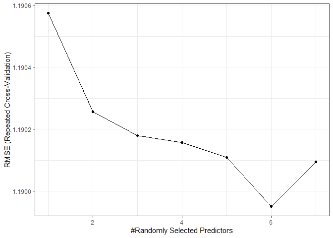

``` r
predictions <- predict(fit, newdata = test[-1])
summaryVal <- data.frame(obs = test$length, pred = predictions)
kable(defaultSummary(summaryVal))
```

|          |          x|
|----------|----------:|
| RMSE     |  1.1792031|
| Rsquared |  0.4839866|
| MAE      |  0.9335613|

Na wykresie można zaobserwować, że optymalna wartość parametru mtry
wynosi 6.

Analiza modelu regresji
-----------------------

``` r
importance <- varImp(fit, scale = FALSE)
ggplot(importance)
```

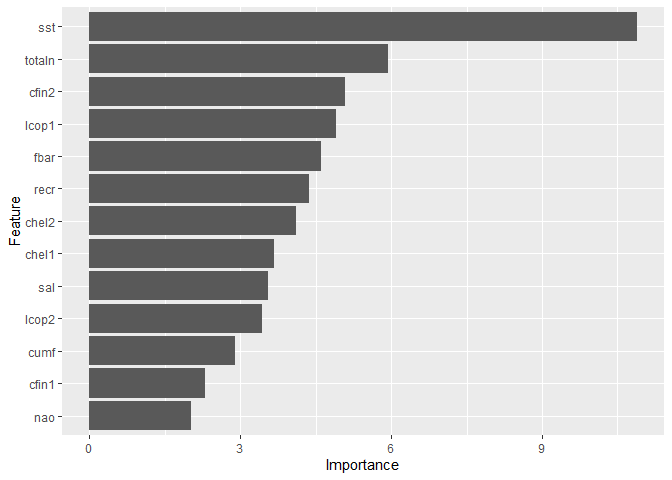

Można zauważyć ponownie, że atrybutem o najwyższej ważności jest
temperatura wody przy powierzchni.

Wykresy wartości atrybutów o największej ważności

``` r
ggplot(clear, aes(x=X)) + 
  stat_smooth(aes(y = length, colour="darkred"), method="gam", formula = y ~s(x)) +
  stat_smooth(aes(y = sst, colour="steelblue"), method="gam", formula = y ~s(x))
```

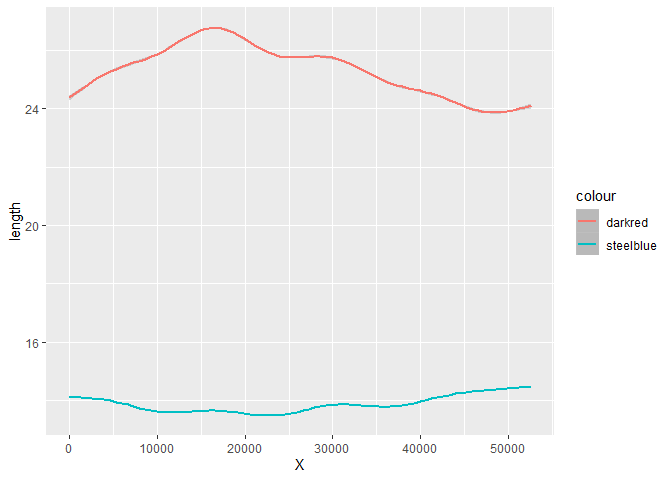

``` r
ggplot(clear, aes(x=X)) + 
  stat_smooth(aes(y = length, colour="darkred"), method="gam", formula = y ~s(x)) +
  stat_smooth(aes(y = chel2, colour="steelblue"), method="gam", formula = y ~s(x))
```

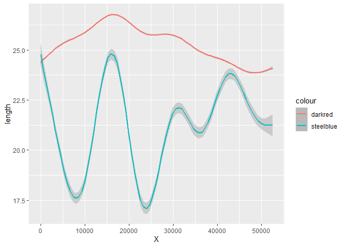

``` r
ggplot(clear, aes(x=X)) + 
  stat_smooth(aes(y = length, colour="darkred"), method="gam", formula = y ~s(x)) +
  stat_smooth(aes(y = lcop1, colour="steelblue"), method="gam", formula = y ~s(x)) 
```

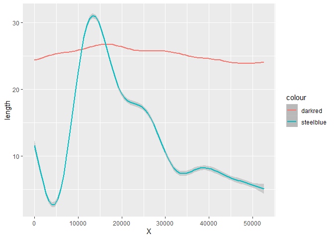

Pomimo wcześniejszych obliczeń wykresy powyżej pokazują, że ciężko
zaobserwować bezpośredni wpływ poszczególnych atrybutów na wielkość
śledzi. Jednak w przypadku wykresu porównania wielkosci śledzia w
związku z wartością atrybutu lcop1 zaobserwować można wzrost i spadek w
tych samych przedziałach, z uwzględnieniem bezwładności reakcji
wielkości śledzia na stężenie planktonu \[widłonogów gat. 1\].
